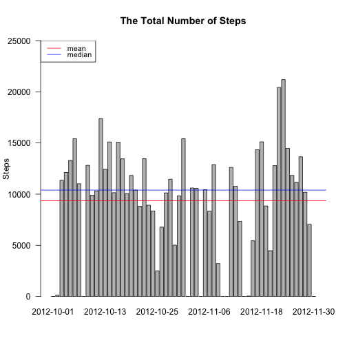
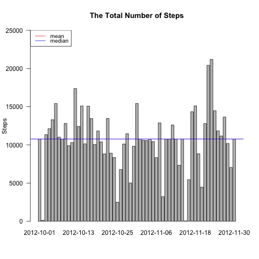

# Reproducible Research: Peer Assessment 1


## Loading and preprocessing the data


```r
# read csv data
moni_data <- read.csv("activity.csv" ,header=TRUE)

#daily total steps
f_date <- factor(moni_data$date)
daily_steps <- tapply(moni_data$steps,f_date,sum,na.rm=TRUE)

#mean of monthly steps
mean_steps <- mean(daily_steps ,na.rm=TRUE)

#median of monthly steps
median_steps <- median(daily_steps ,na.rm=TRUE) 
```


## What is mean total number of steps taken per day?
1. Make a histogram of the total number of steps taken each day

```r
#plot histogram
barplot(daily_steps ,main="The Total Number of Steps" ,ylab="Steps" ,las=1 ,ylim=c(0,25000))

#draw mean and median
abline(h=mean_steps ,col="red")
abline(h=median_steps ,col="blue")
legend("topleft",lwd=1,col=c("red","blue"),
       legend=c("mean","median"),cex=0.9,y.intersp=0.7)
```

 

2. Calculate and report the mean and median total number of steps taken per day

```r
#mean 
print(mean_steps)
```

```
## [1] 9354
```

```r
#median
print(median_steps)
```

```
## [1] 10395
```

* Mean of total number of steps taken per day is **9,354** steps.  
* Median is **10,395**.   

* * *


## What is the average daily activity pattern?
1. Make a time series plot (i.e. type = "l") of the 5-minute interval (x-axis) and the average number of steps taken, averaged across all days (y-axis)


```r
#ave. steps of each time interval
time_series_steps <- tapply(moni_data$steps,moni_data$interval,mean,na.rm=TRUE)

#plot time ~ ave. steps
plot(names(time_series_steps),time_series_steps, type="l"
     ,main="Average steps / every 5-minute"
     ,xlab="Time Interval",ylab="Steps")
```

 
  
  
2. Which 5-minute interval, on average across all the days in the dataset, contains the maximum number of steps?


```r
#convert to dataframe 
time_series_steps_fr <- data.frame(time_interval=names(time_series_steps)
                                   ,steps=time_series_steps)

#max steps
time_series_steps_fr[time_series_steps_fr$steps==max(time_series_steps_fr$steps),]
```

```
##     time_interval steps
## 835           835 206.2
```

* **835**(8:35AM) contains the max.  

* * *

## Imputing missing values
Note that there are a number of days/intervals where there are missing values (coded as NA). The presence of missing days may introduce bias into some calculations or summaries of the data.

1. Calculate and report the total number of missing values in the dataset (i.e. the total number of rows with NAs)


```r
#sum in case of NA
sum(is.na(moni_data$steps))
```

```
## [1] 2304
```

* **2,304** missing values exist.    


2. Devise a strategy for filling in all of the missing values in the dataset. The strategy does not need to be sophisticated. For example, you could use the mean/median for that day, or the mean for that 5-minute interval, etc.

* Fill with hourly average of available values. 


3. Create a new dataset that is equal to the original dataset but with the missing data filled in.


```r
#fill with hourly ave.
moni_data2 <- moni_data
for (i in 0:23){
moni_data2[is.na(moni_data2$steps) & 
                   moni_data2$interval>=i*100 & 
                   moni_data2$interval<(i+1)*100,"steps"] <- 
                        mean(moni_data2[moni_data2$interval>=i*100 & 
                                        moni_data2$interval<(i+1)*100,"steps"],na.rm=TRUE)
}

#ave. steps of each time interval
time_series_steps2 <- tapply(moni_data2$steps,moni_data2$interval,mean,na.rm=TRUE)

#plot time ~ ave. steps
plot(names(time_series_steps2),time_series_steps2, type="l"
     ,main="Average steps / every 5-minute"
     ,xlab="Time Interval",ylab="Steps")
```

 


4. Make a histogram of the total number of steps taken each day and Calculate and report the mean and median total number of steps taken per day. Do these values differ from the estimates from the first part of the assignment? What is the impact of imputing missing data on the estimates of the total daily number of steps?  


```r
#daily total steps
f_date2 <- factor(moni_data2$date)
daily_steps2 <- tapply(moni_data2$steps,f_date2,sum,na.rm=TRUE)

#mean of monthly steps
mean_steps2 <- mean(daily_steps2 ,na.rm=TRUE)

#median of monthly steps
median_steps2 <- median(daily_steps2 ,na.rm=TRUE)
#plot histogram
barplot(daily_steps2 ,main="The Total Number of Steps" ,ylab="Steps" ,las=1 ,ylim=c(0,25000))

#draw mean and median
abline(h=mean_steps2 ,col="red")
abline(h=median_steps2 ,col="blue")
legend("topleft",lwd=1,col=c("red","blue"),
       legend=c("mean","median"),cex=0.9,y.intersp=0.7)
```

 

```r
#mean 
print(mean_steps2)
```

```
## [1] 10766
```

```r
#median
print(median_steps2)
```

```
## [1] 10766
```


* Mean of total number of steps taken per day is **10,766** steps.  
        (was 9,354 before fixing)
* Median is **10,766**.   
        (was 10,395 before fixing)
                

```r
mean(is.na(moni_data))             
```

```
## [1] 0.04372
```

* **4.3\%** of the values in the first dataset was missing.  
The missing values was treated as 0 in total number of the steps 
with "na.rm" option in summing function.  
So after fixing data, the mean of the total number of steps is gained.
And so is the median.

* * *
## Are there differences in activity patterns between weekdays and weekends?
For this part the weekdays() function may be of some help here. Use the dataset with the filled-in missing values for this part.

1. Create a new factor variable in the dataset with two levels – “weekday” and “weekend” indicating whether a given date is a weekday or weekend day.  


```r
#set the all new value "weekday"
moni_data2$wd <- "weekday"
#choose weekend 
moni_data2[as.POSIXlt(as.Date(moni_data2$date))$wday==0 |
           as.POSIXlt(as.Date(moni_data2$date))$wday==6 ,"wd"] <- "weekend"
```


2. Make a panel plot containing a time series plot (i.e. type = "l") of the 5-minute interval (x-axis) and the average number of steps taken, averaged across all weekday days or weekend days (y-axis). The plot should look something like the following, which was creating using simulated data:


```r
#make subset weekdays and weekends
moni_weekday <- subset(moni_data2,moni_data2$wd == "weekday")
moni_weekend <- subset(moni_data2,moni_data2$wd == "weekend")

#ave. steps of each time interval
steps_weekday <- tapply(moni_weekday$steps,moni_weekday$interval,mean,na.rm=TRUE)
steps_weekend <- tapply(moni_weekend $steps,moni_weekend $interval,mean,na.rm=TRUE)

#plot time ~ ave. steps

par(mfrow = c(2,1))

plot(names(steps_weekend),steps_weekend, type="l"
     ,main="weekend"
     ,xlab="Interval",ylab="Number of steps")

plot(names(steps_weekday),steps_weekday, type="l"
     ,main="weekday"
     ,xlab="Interval",ylab="Number of steps")
```

 

* From the graphs above, clearly more active in daytime of weekend.  

